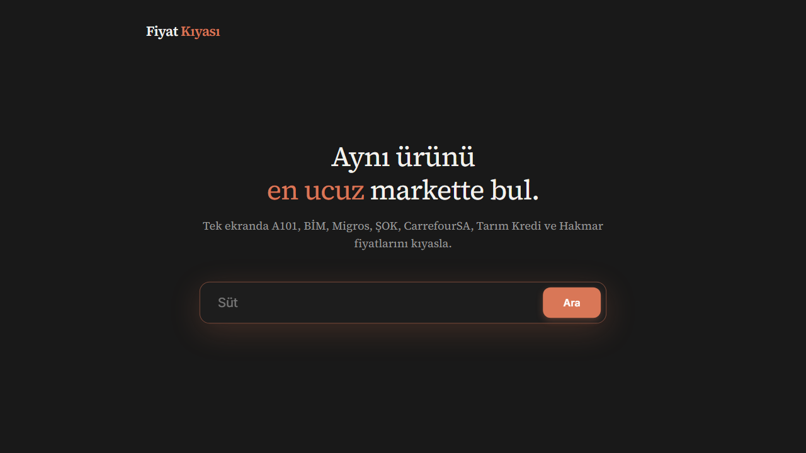

<p align="center">
  
</p>

<h1 align="center">Fiyat Kiyasi</h1>

<p align="center">
  Compare grocery prices across A101, BIM, Migros, SOK, CarrefourSA, Tarim Kredi, and Hakmar in one search.
</p>

<p align="center">
  <a href="https://github.com/onatozmenn/fiyat-kiyasi/stargazers">
    
  </a>
  <a href="https://github.com/onatozmenn/fiyat-kiyasi/network/members">
    
  </a>
  <a href="https://github.com/onatozmenn/fiyat-kiyasi/issues">
    
  </a>
  <a href="./LICENSE">
    
  </a>
  
</p>

<p align="center">
  <a href="#quick-start">Quick Start</a> |
  <a href="#screenshot">Screenshot</a> |
  <a href="#how-it-works-technical">Technical Details</a> |
  <a href="#api-endpoints">API</a> |
  <a href="#roadmap">Roadmap</a>
</p>

## Why This Project?

People overpay for the same product every day because each market uses different naming and pricing patterns.
Fiyat Kiyasi solves that by grouping equivalent products and showing best price first.

If this project helps you save money, give it a star on GitHub:
`https://github.com/onatozmenn/fiyat-kiyasi`

## Screenshot



## Features

- Real-time price data from major Turkish grocery chains
- Smart cross-market product grouping
- Quantity parsing (`kg`, `g`, `L`, `ml`, `x` multipack)
- Unit price calculation
- Smart badges (`FIRSAT`, `POPULAR`, `UCUZ`)
- Infinite scroll with loading states
- Server-side cache with eviction
- Rate limit + payload + input validation
- Zero backend dependencies (pure Node.js `http`)

## How It Works (Technical)

### 1. Request Pipeline

1. Browser sends `POST /api/search` with `keywords`, `pages`, `size`
2. Backend validates and normalizes input
3. Cache key is generated from normalized payload
4. If cache miss, backend calls `api.marketfiyati.org.tr`
5. Raw products are grouped by compatibility rules
6. Backend returns UI-ready `viewModel` array

### 2. Product Matching Engine

Matching is intentionally strict where needed, flexible where useful:

1. **Quantity filter**  
   Products must have same parsed quantity and unit.
2. **Variant filter**  
   Incompatible variants (`zero` vs `light`, etc.) are blocked.
3. **Similarity scoring**  
   Uses both Levenshtein and token containment.
4. **Brand-aware threshold**  
   Same brand can pass with lower threshold.

This design reduces false matches while still grouping differently named items from different markets.

### 3. Backend Generated View Model

For each grouped product:

- markets sorted by price
- `minPrice`, `maxPrice`, savings percentage
- optional unit price per market
- smart badge type for frontend rendering

Frontend stays simple and fast because expensive logic is server-side.

### 4. Security and Reliability

- CORS allowlist
- Rate limiting per IP
- Max request body size
- Input sanitization and JSON validation
- Upstream timeout + retry strategy
- Graceful shutdown handlers

## Architecture

```text
Browser (Vanilla JS)
   |
   v
/api/search (Node http server)
   |-- validate params
   |-- rate limit
   |-- cache lookup
   |-- upstream call (marketfiyati)
   |-- product grouping + scoring
   v
UI-ready JSON response
```

## Tech Stack

| Layer | Technology |
|---|---|
| Backend | Node.js (`http`, `https`, `fs`, `path`) |
| Frontend | Vanilla JS + CSS |
| Data Source | `api.marketfiyati.org.tr` |
| Matching | Levenshtein + token containment + brand normalization |

No Express. No React. No build step.

## Quick Start

```bash
git clone https://github.com/onatozmenn/fiyat-kiyasi.git
cd fiyat-kiyasi
npm install
npm run dev
```

Open `http://localhost:3001`

## API Endpoints

| Endpoint | Method | Purpose |
|---|---|---|
| `/api/search` | `POST` | Search + grouped pricing results |
| `/api/product` | `POST` | Search by identity |
| `/api/similar` | `POST` | Similar product lookup |
| `/api/health` | `GET` | Health and memory/cache info |

Search example:

```bash
curl -X POST http://localhost:3001/api/search \
  -H "Content-Type: application/json" \
  -d '{"keywords":"coca cola","pages":1,"size":24}'
```

## Configuration

Core runtime constants in [`server.js`](./server.js):

| Constant | Default | Description |
|---|---:|---|
| `RATE_LIMIT_WINDOW` | `60000` | Rate limit window (ms) |
| `RATE_LIMIT_MAX` | `60` | Max API requests/IP/window |
| `MAX_BODY_SIZE` | `10240` | Max request body size (bytes) |
| `MAX_KEYWORD_LENGTH` | `200` | Max keyword length |
| `MAX_PAGE_SIZE` | `100` | Max page size |
| `CACHE_TTL` | `60000` | Response cache TTL (ms) |
| `MAX_CACHE_SIZE` | `500` | Max cache entries |
| `CONF_SIMILARITY_THRESHOLD` | `0.55` | Base match threshold |
| `CONF_BADGE_OPPORTUNITY` | `15` | Min savings for `FIRSAT` |
| `CONF_MARKET_POPULARITY_MIN` | `4` | Min markets for `POPULAR` |

## Performance Notes

- Current grouping is `O(n^2)` by design, tuned for small page windows.
- Levenshtein calculations are memoized with bounded cache.
- Cache hits are significantly faster than upstream calls.

## Roadmap

- Better product detail page
- Better analytics for market spread and trend
- Test suite for matching edge cases
- Optional Redis cache adapter
- Optional mobile app wrapper

## Contributing

Contributions are welcome.

1. Fork the repo
2. Create a feature branch
3. Commit focused changes
4. Open a PR with before/after notes

If you want to help, start with issues labeled `good first issue`.

## License

This project is licensed under the ISC License. See [LICENSE](./LICENSE).

---

<p align="center">
  Built for fast price comparison. If you find it useful, please star the repo.
</p>
